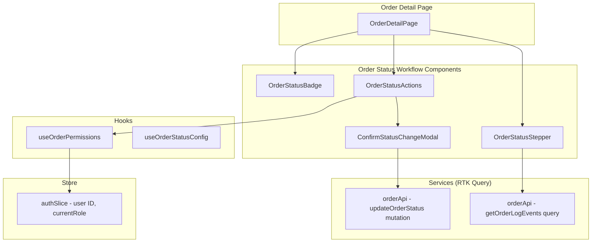
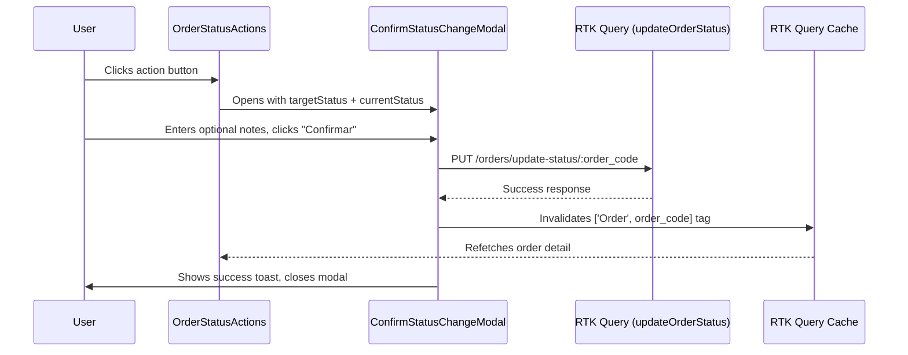

# Design Document: Order Status Workflow

## Overview

This design implements the frontend UI components for managing work order status transitions in the FixSite App. The system provides visual status indicators (badges), a timeline stepper showing order history, contextual action buttons based on current status and user permissions, and a confirmation modal for executing transitions via the existing backend API.

The backend already validates status transitions at `PUT /orders/update-status/:order_code`. The frontend's responsibility is to present the correct UI affordances, enforce permission visibility, and orchestrate the confirmation flow before calling the API.

### Key Design Decisions

1. **Status configuration as a constant map** — All status metadata (label, color, numeric value, allowed transitions) lives in a single `ORDER_STATUS_CONFIG` constant, making it the single source of truth for the UI.
2. **Permission logic via a custom hook** — `useOrderPermissions` encapsulates the technician-match and role-check logic, keeping components declarative.
3. **Modal state via local component state** — The confirmation modal state (which transition is pending) is managed locally in the parent component that renders the Action Bar, avoiding unnecessary global state.
4. **RTK Query cache invalidation** — The `updateOrderStatus` mutation invalidates the `Order` tag to trigger a refetch of the order detail, keeping the UI consistent.
5. **Log events fetched via a dedicated query endpoint** — The stepper retrieves transition history from a separate log events endpoint, decoupled from the main order query.

## Architecture



### Data Flow



## Components and Interfaces

### OrderStatusBadge

A presentational component that renders a colored chip for a given status value.

```typescript
interface OrderStatusBadgeProps {
  status: number;
  size?: 'sm' | 'md';
}
```

**Behavior:**
- Maps numeric status to Spanish label and theme color using `ORDER_STATUS_CONFIG`
- Falls back to "Desconocido" with `gray400` for unrecognized values
- Uses white text on all variants for contrast
- Renders as a `<span>` styled with Styled Components

### OrderStatusStepper

A visual timeline component showing the order's progression through states.

```typescript
interface OrderStatusStepperProps {
  order: WorkOrder;
}
```

**Behavior:**
- Displays the normal flow: PENDING → ASSIGNED → DIAGNOSING → IN_REPAIR → COMPLETED → DELIVERED
- Fetches log events from `GET /orders/:order_code/log-events`
- Maps log entries to steps, showing `created_at` formatted as "dd/MM/yyyy HH:mm"
- Completed steps use `theme.colors.success` marker + colored connector
- Active step uses `theme.colors.primary` marker + bold label
- Pending steps use `theme.colors.textMuted` marker
- Branching states (WAITING_PARTS, CANCELLED) render as secondary indicators attached to the step from which the branch occurred
- Falls back to showing only the current status as active if log events fail or are empty

### OrderStatusActions

The contextual action bar that determines which buttons to show.

```typescript
interface OrderStatusActionsProps {
  order: WorkOrder;
}
```

**Behavior:**
- Uses `useOrderPermissions(order)` to determine button enabled/disabled/hidden state
- Renders different button sets based on `order.status`:
  - ASSIGNED (2): "Iniciar diagnóstico"
  - DIAGNOSING (3): "Diagnóstico completado" + status banner
  - IN_REPAIR (4): "Esperando repuestos" + "Finalizar orden"
  - WAITING_PARTS (8): "Continuar reparación" + info card with notes
  - COMPLETED (5): "Marcar como entregado"
  - DELIVERED (6) / CANCELLED (7): Terminal badge + message, no buttons
- Shows "Cancelar orden" button for statuses 2, 3, 4, 8 (admin-only)
- Manages local state for the pending transition: `{ targetStatus: number } | null`
- Opens `ConfirmStatusChangeModal` when a button is clicked

### ConfirmStatusChangeModal

A modal dialog for confirming status transitions.

```typescript
interface ConfirmStatusChangeModalProps {
  isOpen: boolean;
  onClose: () => void;
  orderCode: string;
  currentStatus: number;
  targetStatus: number;
}
```

**Behavior:**
- Displays title context: "De: {currentLabel} → A: {targetLabel}"
- Shows a TextArea for notes (max 500 chars)
- Notes are mandatory (min 1 non-whitespace char) when target is WAITING_PARTS (8)
- "Confirmar" button triggers `updateOrderStatus` mutation
- Disables "Confirmar" and shows loading spinner during API call
- On success: closes modal, shows success toast, cache invalidation triggers refetch
- On failure: shows error toast with backend message
- Closes on "Cancelar" click, Escape key, or overlay click
- Uses destructive/warning styling when target is CANCELLED (7)

### useOrderPermissions Hook

```typescript
interface OrderPermissions {
  isTechnicianOwner: boolean;
  isAdmin: boolean;
  canPerformTechnicianAction: boolean;
  canPerformAdminAction: boolean;
}

function useOrderPermissions(order: WorkOrder): OrderPermissions;
```

**Logic:**
- `isTechnicianOwner`: `authState.data.user.id === order.assigned_technician_id`
- `isAdmin`: `authState.currentRole?.name` matches "Administrator" or "Receptionist"
- `canPerformTechnicianAction`: `isTechnicianOwner && order.assigned_technician_id !== null`
- `canPerformAdminAction`: `isAdmin`

### ORDER_STATUS_CONFIG Constant

```typescript
interface StatusConfig {
  value: number;
  label: string;
  color: string; // theme color key
}

const ORDER_STATUS_CONFIG: Record<number, StatusConfig> = {
  1: { value: 1, label: 'Pendiente', color: 'gray400' },
  2: { value: 2, label: 'Asignada', color: 'primary' },
  3: { value: 3, label: 'En diagnóstico', color: 'accent' },
  4: { value: 4, label: 'En reparación', color: 'orange' },
  5: { value: 5, label: 'Completada', color: 'success' },
  6: { value: 6, label: 'Entregada', color: 'teal' },
  7: { value: 7, label: 'Cancelada', color: 'error' },
  8: { value: 8, label: 'Esperando repuestos', color: 'purple' },
};
```

## Data Models

### Log Event (API Response)

```typescript
interface OrderLogEvent {
  id: number;
  order_id: number;
  status: number;
  notes: string | null;
  created_at: string; // ISO 8601
  created_by: number;
}
```

### Update Status Request

```typescript
interface UpdateOrderStatusArgs {
  orderCode: string;
  status: number;
  notes?: string;
}
```

### Pending Transition State (local)

```typescript
interface PendingTransition {
  targetStatus: number;
}
```

### RTK Query Endpoint Addition

```typescript
// Added to orderApi.ts via injectEndpoints
updateOrderStatus: builder.mutation<StandardResponse<null>, UpdateOrderStatusArgs>({
  query: ({ orderCode, status, notes }) => ({
    url: `orders/update-status/${orderCode}`,
    method: 'PUT',
    body: { status, ...(notes ? { notes } : {}) },
  }),
  invalidatesTags: (_result, _error, arg) => [{ type: 'Order', id: arg.orderCode }],
}),

getOrderLogEvents: builder.query<OrderLogEvent[], { orderCode: string }>({
  query: ({ orderCode }) => ({
    url: `orders/${orderCode}/log-events`,
    method: 'GET',
  }),
  transformResponse: (response: StandardResponse<OrderLogEvent[]>) => response.data,
  providesTags: (_result, _error, arg) => [{ type: 'Order', id: arg.orderCode }],
}),
```


## Correctness Properties

*A property is a characteristic or behavior that should hold true across all valid executions of a system — essentially, a formal statement about what the system should do. Properties serve as the bridge between human-readable specifications and machine-verifiable correctness guarantees.*

### Property 1: Status configuration mapping is total and correct

*For any* integer value, the `getStatusConfig` function SHALL return the correct Spanish label and theme color key for valid statuses (1–8), and SHALL return `{ label: "Desconocido", color: "gray400" }` for any value outside that range.

**Validates: Requirements 1.1, 1.2, 1.3, 1.4, 1.5, 1.6, 1.7, 1.8, 1.9, 1.11, 10.1**

### Property 2: Stepper step classification is consistent with order status

*For any* valid order status in the normal flow sequence (1→2→3→4→5→6), all steps with a position before the current status SHALL be classified as "completed" (success color), the step matching the current status SHALL be classified as "active" (primary color), and all steps after SHALL be classified as "pending" (textMuted color).

**Validates: Requirements 2.2, 2.3, 2.9**

### Property 3: Status-to-buttons mapping produces the correct action set

*For any* valid order status value, the `getActionsForStatus` function SHALL return exactly the defined set of action buttons: ASSIGNED→["Iniciar diagnóstico"], DIAGNOSING→["Diagnóstico completado"], IN_REPAIR→["Esperando repuestos", "Finalizar orden"], WAITING_PARTS→["Continuar reparación"], COMPLETED→["Marcar como entregado"], DELIVERED→[], CANCELLED→[], PENDING→[]. Additionally, the "Cancelar orden" button SHALL be included for statuses in {2, 3, 4, 8} and excluded for statuses in {1, 5, 6, 7}.

**Validates: Requirements 3.1, 4.1, 5.1, 5.3, 6.1, 7.1, 8.1, 8.2, 9.1, 9.2**

### Property 4: Permission logic correctly determines action authorization

*For any* combination of user ID, current role name, and order assigned_technician_id, the `useOrderPermissions` hook SHALL return `canPerformTechnicianAction = true` if and only if the user ID equals the order's assigned_technician_id AND assigned_technician_id is not null. It SHALL return `canPerformAdminAction = true` if and only if the current role name is "Administrator" or "Receptionist".

**Validates: Requirements 3.3, 4.4, 5.7, 6.4, 6.5, 7.3, 7.4, 9.4, 11.1, 11.2, 11.3, 11.4, 11.5**

### Property 5: Issue resolution gate enables "Finalizar" correctly

*For any* array of OrderIssue items, the "Finalizar orden" button SHALL be enabled if and only if every item in the array has `status === 'RESOLVED'` OR the array is empty.

**Validates: Requirements 5.4, 5.5**

### Property 6: Notes truncation preserves content up to limit

*For any* string, the `truncateNotes` function SHALL return the original string unchanged if its length is ≤ 300 characters, and SHALL return the first 300 characters followed by "…" if its length exceeds 300 characters.

**Validates: Requirements 6.6**

### Property 7: Notes validation enforces mandatory notes for WAITING_PARTS

*For any* target status value and any notes string, the validation function SHALL return valid if target status is NOT WAITING_PARTS (8), OR if the notes string contains at least 1 non-whitespace character. It SHALL return invalid if target status IS WAITING_PARTS (8) AND the notes string is empty or contains only whitespace characters.

**Validates: Requirements 10.3, 10.4, 10.5**

## Error Handling

### API Errors

| Scenario | Handling |
|---|---|
| `updateOrderStatus` mutation fails | Display backend error message via `useToast().showError()`. Modal remains open. Cached order data is NOT modified. |
| `getOrderLogEvents` query fails | Stepper falls back to showing only the current status as active with no timestamps. No error toast (graceful degradation). |
| Network error (FETCH_ERROR) | Handled by `baseApi` interceptor — shows connection error alert. |
| 401 Unauthorized | Handled by `baseApi` interceptor — logs out user and redirects to `/login`. |

### Validation Errors

| Scenario | Handling |
|---|---|
| Notes empty when target is WAITING_PARTS | Inline validation error below TextArea: "Las notas son requeridas para este cambio de estado." |
| Notes exceed 500 characters | TextArea `maxLength` attribute prevents input beyond 500 chars. |

### Edge Cases

| Scenario | Handling |
|---|---|
| Order has no assigned technician | All technician action buttons are hidden (ASSIGNED status) or disabled (other statuses). |
| Unrecognized status value | Badge shows "Desconocido" / gray400. Action bar renders no buttons. |
| Rapid double-click on "Confirmar" | Button is disabled immediately when mutation starts (`isLoading` from RTK Query). |
| Modal opened but order status changes (stale) | Cache invalidation from another source will update the order, and the parent component re-renders with new status, closing the modal if the transition is no longer valid. |

## Testing Strategy

### Unit Tests (Example-Based)

- **OrderStatusBadge**: Render each known status, verify label text and background color class.
- **OrderStatusStepper**: Render with mock log events, verify step order, branching state rendering, date formatting.
- **OrderStatusActions**: Render for each status with mock permissions, verify correct buttons appear.
- **ConfirmStatusChangeModal**: Verify modal title shows correct labels, notes TextArea renders, loading state disables button.
- **Terminal states**: Verify DELIVERED/CANCELLED show badge + message, no buttons.

### Property-Based Tests

Library: **fast-check** (TypeScript property-based testing library)

Configuration: Minimum 100 iterations per property test.

| Property | Test Description |
|---|---|
| Property 1 | Generate random integers, verify `getStatusConfig` returns correct config or fallback |
| Property 2 | Generate random valid statuses (1-6), verify step classification logic |
| Property 3 | Generate random valid statuses (1-8), verify `getActionsForStatus` returns correct button set |
| Property 4 | Generate random `{ userId, roleName, assignedTechnicianId }` tuples, verify permission logic |
| Property 5 | Generate random arrays of `{ status: 'PENDING' | 'RESOLVED' | 'REJECTED' }`, verify gate logic |
| Property 6 | Generate random strings of varying lengths (0-1000), verify truncation behavior |
| Property 7 | Generate random `{ targetStatus, notes }` pairs, verify validation result |

Tag format: `Feature: order-status-workflow, Property {N}: {title}`

### Integration Tests

- **updateOrderStatus mutation**: Mock API, verify correct URL/method/body, verify cache invalidation on success.
- **getOrderLogEvents query**: Mock API, verify data transformation and tag provision.
- **Full flow**: Mount OrderStatusActions → click button → verify modal opens → confirm → verify API call → verify toast + cache invalidation.

### Accessibility

- Modal traps focus and supports Escape to close.
- Disabled buttons have `aria-disabled` and tooltips explaining why.
- Status badge uses `aria-label` with the status text for screen readers.
- Stepper uses `aria-current="step"` on the active step.
