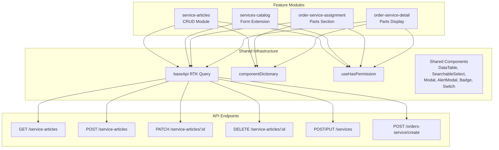

# Design Document: Service Parts Requirement

## Overview

This feature adds four independent frontend modules to the FixSite application that enable parameterization of spare parts (articles) for services and handle inventory consumption when assigning services to work orders.

The feature covers:
1. **ServiceArticle CRUD** — manage article configurations per service
2. **Service Form modification** — toggle `requires_articles` flag on services
3. **Parts section in service assignment** — select store + articles when assigning a service that requires parts
4. **Parts display in OrderService detail** — read-only view of consumed parts with MaterialIssue badge

Each module is an independent feature with its own route, permission control, RTK Query endpoints, Zod schemas, and page components. All modules follow the project's established patterns: `baseApi.injectEndpoints`, `zodResolver`, `componentDictionary` registration, and Spanish-language UI.

## Architecture



### Module Organization

```
src/features/
├── service-articles/              # NEW — ServiceArticle CRUD
│   ├── components/
│   │   ├── ServiceArticleForm.tsx
│   │   └── StockErrorTable.tsx
│   ├── pages/
│   │   └── ServiceArticlesPage.tsx
│   ├── schemas/
│   │   ├── service-article.schema.ts
│   │   └── index.ts
│   └── services/
│       └── ServiceArticleApi.ts
├── services-catalog/              # EXISTING — extended with requires_articles
│   ├── schemas/
│   │   └── service.schema.ts      # MODIFIED — add requires_articles
│   └── pages/
│       └── ServicesPage.tsx        # MODIFIED — add Switch + nav button
├── orders/                        # EXISTING — extended with parts section
│   ├── components/
│   │   ├── AssignServiceParts.tsx  # NEW — parts section component
│   │   └── OrderServiceParts.tsx   # NEW — parts display component
│   └── pages/
│       └── InfoOrderPage.tsx       # MODIFIED — integrate parts display
```

## Components and Interfaces

### 1. ServiceArticle CRUD Module

**ServiceArticlesPage** — Main page with paginated DataTable, search, create/edit modal, and delete confirmation.

Props: Receives `service_id` from route params.

Key behaviors:
- Fetches paginated list via `GET /service-articles?service_id=X&page=&limit=&filter=`
- Search with 300ms debounce, resets to page 1
- Create/Edit via Modal with `ServiceArticleForm`
- Delete via AlertModal confirmation
- Shows empty state when `requires_articles = false` or no articles configured

**ServiceArticleForm** — Reusable form component for create and edit.

```typescript
interface ServiceArticleFormProps {
  serviceId: number;
  editingArticle: ServiceArticle | null;
  onSuccess: () => void;
  onCancel: () => void;
}
```

- Create mode: SearchableSelect for article (search by name/SKU, min 2 chars, max 50 results), quantity input, active toggle (default true)
- Edit mode: Read-only article name, editable quantity + active toggle
- Validation via `ServiceArticleSchema`

**StockErrorTable** — Inline error table for stock insufficiency errors.

```typescript
interface StockErrorTableProps {
  errors: Array<{ article_id: number; required: number; available: number }>;
  articleNames: Map<number, string>;
}
```

### 2. Service Form Extension

Modifications to existing `ServicesPage.tsx`:
- Add `requires_articles` Switch control to the create/edit modal
- When editing a service with `requires_articles = true`, show a navigation button to ServiceArticle CRUD
- In creation mode, never show the navigation button

### 3. Parts Section in Service Assignment

**AssignServiceParts** — Conditional section within the order-service assignment form.

```typescript
interface AssignServicePartsProps {
  serviceId: number;
  requiresArticles: boolean;
  control: Control<AssignmentFormData>;
  errors: FieldErrors<AssignmentFormData>;
  setValue: UseFormSetValue<AssignmentFormData>;
  watch: UseFormWatch<AssignmentFormData>;
}
```

Key behaviors:
- Only visible when `requires_articles = true`
- Fetches active stores via SearchableSelect
- Pre-fills article list from `GET /service-articles?service_id=X` with rounded quantities (min 1)
- Allows quantity adjustment (integer, 1–10000)
- Allows adding/removing articles (max 50, no duplicates)
- Clears state on service change
- Displays stock error table on 400 responses

### 4. Parts Display in OrderService Detail

**OrderServiceParts** — Read-only display of consumed parts.

```typescript
interface OrderServicePartsProps {
  parts: OrderServicePart[];
  materialIssueId: number | null;
  materialIssueStatus: 'DRAFT' | 'PENDING' | 'APPROVED' | null;
}

interface OrderServicePart {
  article_name: string;
  sku: string;
  quantity: number;
  store_name: string;
}
```

Key behaviors:
- Renders list of parts with article name, SKU, quantity, store name
- Shows "no parts consumed" message when array is empty
- Displays MaterialIssue Badge with status-based variant (info/warning/success)
- Badge links to MaterialIssue detail route

### 5. OrderService Deletion Logic

Extension to existing deletion flow:
- If `material_issue_status === 'APPROVED'` → block with error alert, no API call
- If `material_issue_status === 'DRAFT' | 'PENDING'` → warning modal about cancellation
- If no material issue → standard confirmation modal

## Data Models

### ServiceArticle (API Response)

```typescript
interface ServiceArticle {
  id: number;
  service_id: number;
  article_id: number;
  article_name: string;
  article_sku: string;
  unit_measurement: string;
  default_quantity: number;
  is_active: boolean;
  created_at: string;
  updated_at: string;
}
```

### ServiceArticle API Endpoints

```typescript
// GET /service-articles (paginated)
interface ServiceArticlesListResponse {
  success: boolean;
  status: number;
  message: string;
  data: ServiceArticle[];
  pagination: {
    page: number;
    limit: number;
    totalPages: number;
    total: number;
  };
}

// POST /service-articles
interface CreateServiceArticleDto {
  service_id: number;
  article_id: number;
  default_quantity: number;
  is_active: boolean;
}

// PATCH /service-articles/:id
interface UpdateServiceArticleDto {
  default_quantity?: number;
  is_active?: boolean;
}
```

### Extended Service Model

```typescript
interface Service {
  id: number;
  code: string;
  description: string;
  base_price: number;
  is_active: boolean;
  requires_articles: boolean;  // NEW field
  createdAt: string;
  updatedAt: string;
}
```

### Assignment Parts Payload

```typescript
interface CreateOrderServiceDto {
  order_id: number;
  service_id: number;
  price: number;
  estimated_time: number;
  issue_ids: number[];
  store_id?: number;        // NEW — required when requires_articles
  parts?: PartItem[];       // NEW — required when requires_articles
}

interface PartItem {
  article_id: number;
  quantity: number;
}
```

### OrderService Extended Response

```typescript
interface OrderServiceDetail {
  id: number;
  service_id: number;
  service_name: string;
  price: number;
  estimated_time: number;
  // NEW fields
  parts: OrderServicePart[];
  material_issue_id: number | null;
  material_issue_status: 'DRAFT' | 'PENDING' | 'APPROVED' | null;
}

interface OrderServicePart {
  article_id: number;
  article_name: string;
  sku: string;
  quantity: number;
  store_name: string;
}
```

### Stock Error Response

```typescript
interface StockErrorResponse {
  success: boolean;
  status: 400;
  message: 'Stock insuficiente para completar la solicitud';
  errors: Array<{
    article_id: number;
    required: number;
    available: number;
  }>;
}
```

### Zod Schemas

**ServiceArticleSchema** (create/edit form):

```typescript
const ServiceArticleSchema = z.object({
  article_id: z.number().min(1, "Debe seleccionar un artículo."),
  default_quantity: z
    .number({ error: "La cantidad debe ser un número." })
    .min(0.01, "La cantidad debe ser un número entre 0.01 y 9999.99")
    .max(9999.99, "La cantidad debe ser un número entre 0.01 y 9999.99")
    .refine(
      (val) => Number((val * 100).toFixed(0)) === val * 100,
      "La cantidad permite máximo 2 decimales."
    ),
  is_active: z.boolean(),
});
```

**ServiceSchema** (extended):

```typescript
const ServiceSchema = z.object({
  code: z.string().min(1, "El código es requerido.").max(50),
  description: z.string().min(1, "La descripción es requerida.").max(255),
  base_price: z.number().positive("El precio base debe ser mayor a 0."),
  is_active: z.boolean(),
  requires_articles: z.boolean(),  // NEW
});
```

**AssignmentPartsSchema** (parts section validation):

```typescript
const AssignmentPartItemSchema = z.object({
  article_id: z.number().min(1),
  article_name: z.string(),
  sku: z.string(),
  quantity: z
    .number({ error: "La cantidad debe ser un número entero." })
    .int("La cantidad debe ser un número entero.")
    .min(1, "La cantidad mínima es 1.")
    .max(10000, "La cantidad máxima es 10000."),
});

const AssignmentPartsSchema = z.object({
  store_id: z.number().min(1, "Debe seleccionar un almacén."),
  parts: z
    .array(AssignmentPartItemSchema)
    .min(1, "Debe incluir al menos una parte.")
    .max(50, "Se alcanzó el máximo de 50 artículos."),
});
```

## Correctness Properties

*A property is a characteristic or behavior that should hold true across all valid executions of a system — essentially, a formal statement about what the system should do. Properties serve as the bridge between human-readable specifications and machine-verifiable correctness guarantees.*

### Property 1: ServiceArticle quantity validation accepts valid decimals and rejects invalid ones

*For any* number `n`, the ServiceArticle quantity validation SHALL accept `n` if and only if `0.01 ≤ n ≤ 9999.99` and `n` has at most 2 decimal places; otherwise it SHALL reject with the appropriate error message.

**Validates: Requirements 2.5, 3.2**

### Property 2: Edit form PATCH payload contains only changed fields

*For any* ServiceArticle with original values `{default_quantity: Q1, is_active: A1}` and new form values `{default_quantity: Q2, is_active: A2}`, the PATCH request body SHALL contain only the fields where the new value differs from the original value.

**Validates: Requirements 3.4**

### Property 3: Default quantity rounding produces integer ≥ 1

*For any* ServiceArticle default_quantity value `d` (positive decimal), the pre-filled assignment quantity SHALL equal `Math.max(1, Math.round(d))`.

**Validates: Requirements 6.3**

### Property 4: Assignment part quantity validation accepts valid integers in range

*For any* integer `n`, the assignment part quantity validation SHALL accept `n` if and only if `1 ≤ n ≤ 10000`; non-integers and values outside the range SHALL be rejected.

**Validates: Requirements 6.4**

### Property 5: Duplicate article prevention in parts list

*For any* parts list containing article with `article_id = X`, attempting to add another article with `article_id = X` SHALL be rejected with the message "Este artículo ya fue agregado", and the parts list SHALL remain unchanged.

**Validates: Requirements 6.6**

### Property 6: Service change clears parts state

*For any* service change in the Assignment_Form (from service A to service B), the parts list SHALL be empty and the store selection SHALL be null after the change, regardless of previous state.

**Validates: Requirements 6.2, 6.11**

### Property 7: Stock error table renders correct number of rows

*For any* stock error response with `errors` array of length N (N ≥ 1), the stock error table SHALL render exactly N rows, each showing the article name, required quantity, and available quantity from the corresponding error item.

**Validates: Requirements 7.1**

### Property 8: Form state preserved on stock-related errors

*For any* form state and any stock-related API error (400 with stock message, article not permitted, store inactive, or duplicates), the System SHALL preserve all current form values (store_id, parts array, quantities) without clearing or navigating away.

**Validates: Requirements 7.7**

### Property 9: Deletion blocked for OrderService with APPROVED MaterialIssue

*For any* OrderService whose associated MaterialIssue status is APPROVED, attempting deletion SHALL display an error alert with message "No se puede eliminar: el egreso de material ya fue aprobado" and SHALL NOT send a DELETE request to the backend.

**Validates: Requirements 9.1**

## Error Handling

### API Error Strategy

| Error Type | HTTP Status | Handling |
|---|---|---|
| Validation error (Zod) | N/A (client) | Inline field errors in Spanish |
| Duplicate ServiceArticle | 409 | Specific message: "Este artículo ya está configurado para este servicio" |
| Stock insufficient | 400 | Inline StockErrorTable with retry capability |
| Article not permitted | 400 | Inline error + error border on article field |
| Store inactive/missing | 400 | Inline error + error border on store selector |
| Duplicate articles in request | 400 | Inline error above parts list |
| Generic server error | 5xx | Toast: "No se pudo completar la operación. Intente nuevamente." |
| Network error | FETCH_ERROR | Toast: "Error de conexión. Verifique su red." |
| Unauthorized | 401 | Handled by baseApi (redirect to login) |

### Error Display Hierarchy

1. **Field-level**: Zod validation errors shown inline below the field
2. **Section-level**: Stock errors and backend validation errors shown as inline table/message within the form section
3. **Page-level**: Toast notifications for success/generic errors
4. **Modal-level**: AlertModal for deletion confirmations and blocking errors (APPROVED MaterialIssue)

### Form Resilience Rules

- Stock errors: preserve ALL form state, keep form editable, allow retry
- Network errors: preserve form state, show toast, re-enable submit button
- 409 conflicts: preserve form state, show specific message
- Successful operations: clear form, close modal, refresh list

## Testing Strategy

### Unit Tests (Example-Based)

Focus on specific scenarios and edge cases:

- Component rendering (columns, empty states, loading states)
- Conditional rendering (requires_articles toggle, MaterialIssue badge variants)
- Modal lifecycle (open/close/confirm/cancel flows)
- Permission-gated rendering (buttons hidden without permission)
- Error message mapping (409 → specific message, 5xx → generic)
- Default values (is_active = true on create, requires_articles = false on new service)

### Property-Based Tests

**Library**: [fast-check](https://github.com/dubzzz/fast-check) (already compatible with Vitest)

**Configuration**: Minimum 100 iterations per property test.

Each property test references its design document property:

| Test | Property | Tag |
|---|---|---|
| Quantity schema validation | Property 1 | `Feature: service-parts-requirement, Property 1: ServiceArticle quantity validation` |
| PATCH delta logic | Property 2 | `Feature: service-parts-requirement, Property 2: Edit form PATCH only changed fields` |
| Rounding function | Property 3 | `Feature: service-parts-requirement, Property 3: Default quantity rounding` |
| Integer quantity validation | Property 4 | `Feature: service-parts-requirement, Property 4: Assignment part quantity validation` |
| Duplicate prevention | Property 5 | `Feature: service-parts-requirement, Property 5: Duplicate article prevention` |
| Service change state clear | Property 6 | `Feature: service-parts-requirement, Property 6: Service change clears parts state` |
| Error table rows | Property 7 | `Feature: service-parts-requirement, Property 7: Stock error table row count` |
| Form preservation | Property 8 | `Feature: service-parts-requirement, Property 8: Form state preserved on stock errors` |
| Deletion guard | Property 9 | `Feature: service-parts-requirement, Property 9: Deletion blocked for APPROVED` |

### Integration Tests

- RTK Query cache invalidation after CRUD operations
- Navigation flow: Service form → ServiceArticle CRUD → back
- Full assignment flow: select service → fill parts → submit → handle errors → retry
- Deletion flow with MaterialIssue status awareness

### Test File Organization

```
src/features/service-articles/__tests__/
├── service-article.schema.property.test.ts   # Properties 1, 4
├── service-article-form.test.tsx              # Unit tests for form
├── service-articles-page.test.tsx             # Unit tests for listing
├── patch-delta.property.test.ts              # Property 2
├── quantity-rounding.property.test.ts        # Property 3
├── parts-list.property.test.ts              # Properties 5, 6
├── stock-error.property.test.ts             # Properties 7, 8
└── deletion-guard.property.test.ts          # Property 9
```
